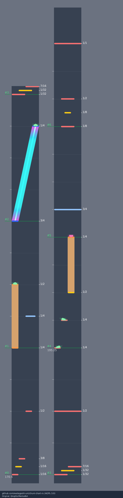

# chuni-chart-rs

C2S 谱面预览服务。Rust 直接生成 PNG / JPEG，沿用 [MarisaBot / Marisa.Frontend](https://github.com/QingQiz/MarisaBot) 的灰色轨道、小节分列、圆角 note、slide 渐变和 AIR 样式。

部署者把谱面文件放进目录，网页或 Bot 通过文件名请求图片。运行时只需要一个二进制文件，字体已内嵌。



## 快速启动

```sh
cargo build --release --locked
mkdir -p charts
# 将谱面文件放入 charts，例如 1086_03.c2s
./target/release/chuni-chart-rs serve --chart-dir ./charts --listen 127.0.0.1:3000
```

浏览器打开 `http://127.0.0.1:3000/`。环境变量 `CHART_DIR`、`LISTEN` 也可设置目录和监听地址。

## 图片接口

```text
GET /preview?name=1086_03
GET /api/render?name=1086_03&format=jpg
GET /judge?name=1086_03
GET /api/render?name=1086_03&judge=1&format=png
GET /preview?name=1086_03&column=3
GET /healthz
```

成功直接返回图片字节，可供 Bot 下载发送。`name` 可以带 `.c2s` 后缀，文件名仅支持字母、数字、下划线和连字符，长度不超过 80；不接受目录路径。

| 参数 | 默认值 | 用途 |
| --- | --- | --- |
| `name` | 必填 | 谱面文件名 |
| `format` | `png` | `png`、`jpg` 或 `jpeg` |
| `judge` | `0` | `1` 显示判定范围；`/judge` 固定开启 |
| `easy` | `0` | `1` 使用 BASIC / ADVANCED 时间窗口 |
| `column` | 全谱 | 从 1 开始的列号，便于查看局部细节 |
| `zoom` | `1` | 纵向比例，范围 0.5–2 |

找不到谱面返回 `404`；输入过大返回 `400`；解析失败、资源超限或超时返回 `422`；已有任务在生成时返回 `429` 和 `Retry-After: 2`。调用方可稍后重试。服务不预热、不保存图片缓存。

## 命令行出图

```sh
./target/release/chuni-chart-rs render charts/1086_03.c2s -o chart.png
./target/release/chuni-chart-rs render charts/1086_03.c2s --column 3 -o detail.png
./target/release/chuni-chart-rs render charts/1086_03.c2s --judge -o judge.jpg
./target/release/chuni-chart-rs inspect charts/1086_03.c2s > timing.json
```

时间使用小数 BPM 分段积分，保持线性时间轴。分列沿用原项目的小节长度统计与合并规则，列底部对齐，并保留接缝重叠区。SFL / SV2 绘制为标记，不改变时间轴。超界 note 和长条按原坐标计算，只绘制 16 轨以内的部分，完全在轨道外的图形不显示，列宽保持不变。字体栅格化、亚像素坐标和整图缩放可能与浏览器存在少量像素差异。

判定图提供普通 TAP、HOLD / SLIDE 头和 critical note 的范围及相邻 note 保护边界；FLICK 单独显示触摸入口。AIR、持续判定和实际操作状态不作为 JC / JUSTICE / ATTACK 矩形计算。包含超界地面 note 的谱面目前仅支持普通图；`inspect` 会返回 `judgement_supported: false`。

## Linux 部署

建议使用 systemd 管理二进制服务。仓库附带 [service 文件](deploy/chuni-chart.service)，默认仅监听本机，外部访问由部署者的反向代理转发。

```sh
git clone https://github.com/watagashi-uni/chuni-chart-rs.git
cd chuni-chart-rs
cargo build --release --locked
sudo useradd --system --no-create-home --shell /usr/sbin/nologin chuni-chart
sudo install -d /opt/chuni-chart/bin /srv/chuni-chart/charts
sudo install -m 755 target/release/chuni-chart-rs /opt/chuni-chart/bin/
sudo install -m 644 deploy/chuni-chart.service /etc/systemd/system/
# 将谱面放入 /srv/chuni-chart/charts，并让 chuni-chart 用户可以读取
sudo systemctl daemon-reload
sudo systemctl enable --now chuni-chart
```

更新时在源码目录 `git pull --ff-only`，重新编译并安装二进制，然后 `sudo systemctl restart chuni-chart`。预编译 Linux musl 包可以从 Releases 下载。

资源限制：

- 每个服务进程最多运行一个渲染子进程，不积压渲染任务。
- 输入上限 2 MiB，最多 12,000 个 note / 长条 / 变速事件，谱面最长 600 秒。
- 整图自动等比缩小至最多 1,200 万像素，单边最多 16,384 像素，编码结果最多 16 MiB。
- Linux 子进程地址空间上限 256 MiB，CPU 时间上限 12 秒；默认墙钟超时 15 秒，超时终止并回收。
- systemd 示例限制整个服务及其子进程最多 384 MiB，禁用 swap。其他系统仍有输入、像素、并发及超时限制，但不使用 Linux `RLIMIT_AS`。

## 开发验证

```sh
cargo fmt --all -- --check
cargo clippy --all-targets --locked -- -D warnings
cargo test --locked
cargo build --release --locked
python3 scripts/smoke.py
```

测试覆盖小数 BPM、长条连接、critical / 重叠保护、120 组随机数值回归、文件名边界、PNG/JPEG 出图，以及真实 HTTP 子进程的并发拒绝、超时回收和失败恢复。测试谱面为自制样例。

可选：与现有 JavaScript 实现比对自己的 C2S 文件：

```sh
node scripts/compare-reference.cjs /path/to/chuni-judgement /path/to/chart.c2s
```

## License

AGPL-3.0-only。原项目和数值规则参考见 [NOTICE](NOTICE)，字体许可见 [assets/FONT-LICENSE](assets/FONT-LICENSE)。
